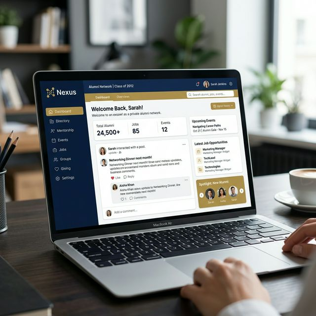
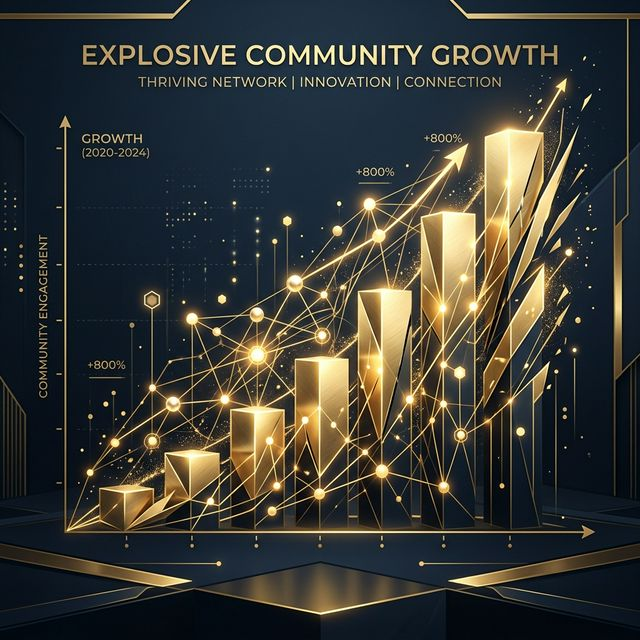

# OSA: The Future of Alumni Networks 🎓

Welcome to the **Old Students Platform (OSA)** — a purpose-built, multi-school platform designed to connect alumni, raise funds, and build a lasting digital legacy for secondary schools around the world.

*A sleek, modern platform replacing noisy group chats with an organized digital home.*

---

## 🌍 The Challenge: WhatsApp is Not Infrastructure

For decades, alumni networks have been the backbone of professional and social growth, especially for prestigious secondary schools. Yet, the tools used to manage these networks are fundamentally broken:
- **Scattered Communication:** Important announcements get lost in endless WhatsApp messages.
- **Lost Memories:** Email threads are forgotten and photos disappear.
- **Informal Fundraising:** Raising money for schools or peers often means tracking manual bank transfers across personal accounts.
- **No Institutional Memory:** Handing over governance to the next batch of executives is a logistical nightmare.

## 🚀 The Solution: A Purpose-Built Digital Home

OSA is not just another social network. It is **infrastructure for communities**. By eliminating feeds, comment sections, and public profiles, OSA focuses entirely on what matters: **high-signal engagement.**

*Empowering diverse professionals to connect meaningfully across the globe.*

### 1. 📬 Curated Monthly Newsletters
Say goodbye to spam. Communication on OSA is structured around a beautifully formatted, monthly newsletter. Members submit professional updates, personal news, and tributes. Executives review, approve, and dispatch a polished HTML email to the entire year group. 

### 2. 💰 Transparent, Goal-Driven Fundraising
From emergency relief to long-term school development projects, OSA provides a transparent fundraising hub.
- Create campaigns targeted at specific year groups or the entire school network.
- Track goals with live progress bars and milestone updates.
- Keep a permanent, verifiable record of all donor contributions.

### 3. 📅 Virtual & Physical Event Management
Whether it's a casual virtual hangout, a professional webinar, or the grand annual reunion, OSA manages the RSVPs effortlessly. Virtual links are kept secure and only revealed to confirmed attendees.

### 4. 📇 A Private, Defensible Directory
A dynamic, searchable directory of verified old students. You control your privacy: choose whether your contact details are seen strictly by your Year Group, all Old Students, or hidden entirely.

---

## 📈 Unlocking Community Growth

*OSA drives structured engagement, ensuring your community thrives year over year.*

When a community has real digital infrastructure, engagement skyrockets. The "Cheque Colour" identity system gives every year group a distinct visual identity, fostering pride and healthy competition in fundraising and event attendance.

---

## 🏢 Partner with ICUNI Labs

Built and maintained by **ICUNI Labs**, OSA is a premium B2B SaaS product. We partner with associations to host their communities securely. 

**What you get:**
- An isolated, secure data environment for your school.
- Zero maintenance required from your executives.
- A seamless, branded experience for your members to connect, contribute, and convene.

### Ready to elevate your old students association? 
**[Contact ICUNI Labs today to bring OSA to your school.]**
